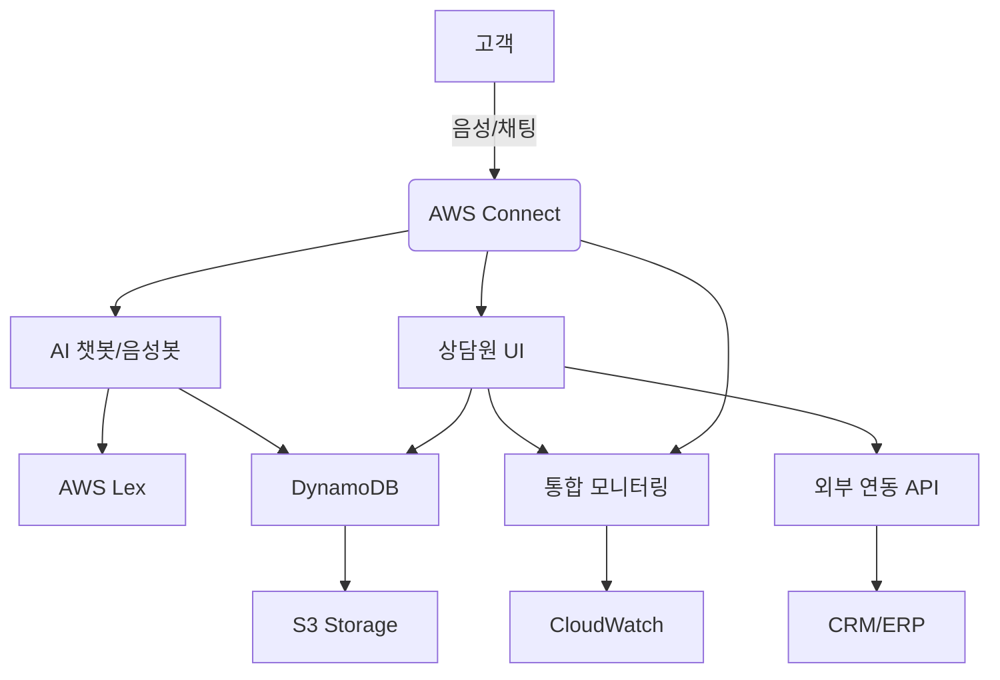

# AWS Connect 기반 AI 콜센터 (AICC Cloud)

[](https://github.com/choiss7/aicc_cloud)
[](https://python.org)
[](https://aws.amazon.com/connect/)
[](LICENSE)

> 🚀 **AWS Connect를 기반으로 한 차세대 AI 콜센터 솔루션**  
> 인공지능 챗봇, 음성봇, 상담원 지원 시스템을 통합한 클라우드 네이티브 컨택센터 플랫폼

## 📋 목차

- [프로젝트 개요](#-프로젝트-개요)
- [주요 기능](#-주요-기능)
- [시스템 아키텍처](#-시스템-아키텍처)
- [기술 스택](#-기술-스택)
- [프로젝트 구조](#-프로젝트-구조)
- [설치 및 설정](#-설치-및-설정)
- [사용법](#-사용법)
- [API 문서](#-api-문서)
- [개발 가이드](#-개발-가이드)
- [테스트](#-테스트)
- [배포](#-배포)
- [기여하기](#-기여하기)
- [라이선스](#-라이선스)

## 🎯 프로젝트 개요

**AICC Cloud**는 AWS Connect를 중심으로 구축된 현대적인 AI 콜센터 솔루루션입니다. 자연어 처리 기반의 지능형 챗봇과 음성봇을 통해 고객 상담의 효율성을 극대화하고, 상담원을 위한 통합 지원 시스템을 제공합니다.

### 🎯 프로젝트 목표
- **고객 만족도 향상**: AI 기반 자동 응대로 24/7 즉시 서비스 제공
- **운영 효율성 극대화**: 상담원 업무 지원 및 자동화를 통한 생산성 향상
- **확장성 보장**: 클라우드 네이티브 아키텍처로 유연한 확장 지원
- **데이터 기반 인사이트**: 실시간 모니터링 및 분석을 통한 서비스 개선

### 📊 프로젝트 정보
- **개발 기간**: 2개월 (8주)
- **개발 팀**: 3인 개발팀
- **개발 방법론**: 애자일 개발, CI/CD 파이프라인
- **현재 버전**: v0.5 (2024-06-14)

## ✨ 주요 기능

### 🤖 AI 챗봇/음성봇
- **자연어 이해(NLU)**: AWS Lex 기반 한국어 최적화 처리
- **지능형 응답**: FAQ, 시나리오 기반 자동 응대
- **상담원 연결**: 복잡한 문의 시 자동 에스컬레이션
- **다채널 지원**: 웹채팅, 음성통화, 모바일 앱 연동

### 👥 상담원 지원 시스템
- **통합 데스크탑**: 웹 기반 상담 인터페이스
- **실시간 고객 정보**: 상담 이력, 고객 프로필 즉시 조회
- **상담 가이드**: 상황별 스크립트 및 업무 가이드 제공
- **품질 관리**: 상담 녹취, 평가, 피드백 시스템

### 📊 통합 모니터링
- **실시간 대시보드**: 상담 현황, 대기열, 성과 지표
- **품질 분석**: 상담 품질 평가 및 개선 제안
- **성과 관리**: 상담원별/팀별 KPI 추적
- **장애 대응**: 자동 알림 및 장애 복구 시스템

### 🔗 외부 시스템 연동
- **CRM/ERP 연동**: REST API 기반 데이터 동기화
- **알림 서비스**: SMS, 이메일, 푸시 알림
- **결제 시스템**: 안전한 결제 처리 연동
- **보고서 생성**: 자동화된 리포팅 시스템

## 🏗️ 시스템 아키텍처



### 핵심 구성 요소
- **AWS Connect**: 중앙 통신 허브 및 라우팅
- **AWS Lex**: 자연어 처리 및 의도 분석
- **DynamoDB**: 고성능 NoSQL 데이터베이스
- **S3**: 녹취 파일 및 문서 저장
- **CloudWatch**: 모니터링 및 로깅
- **Lambda**: 서버리스 비즈니스 로직

## 🛠️ 기술 스택

### Backend
- **Python 3.8+**: 메인 개발 언어
- **FastAPI**: 고성능 웹 프레임워크
- **Boto3**: AWS SDK for Python
- **Pydantic**: 데이터 검증 및 직렬화

### AWS Services
- **AWS Connect**: 컨택센터 플랫폼
- **AWS Lex**: 자연어 처리
- **DynamoDB**: NoSQL 데이터베이스
- **S3**: 객체 스토리지
- **Lambda**: 서버리스 컴퓨팅
- **CloudWatch**: 모니터링 및 로깅

### Development Tools
- **Git**: 버전 관리
- **Docker**: 컨테이너화
- **pytest**: 테스트 프레임워크
- **Black**: 코드 포매팅
- **pre-commit**: Git 훅 관리

## 📁 프로젝트 구조

```
aicc_cloud/
├── src/                          # 소스 코드
│   ├── api/                      # API 엔드포인트
│   │   ├── chatbot_api.py       # 챗봇 API
│   │   └── admin_api.py         # 관리자 API
│   ├── models/                   # 데이터 모델
│   │   ├── user.py              # 사용자 모델
│   │   ├── agent.py             # 상담원 모델
│   │   └── conversation.py      # 대화 모델
│   ├── services/                 # 비즈니스 로직
│   │   ├── conversation_service.py
│   │   ├── escalation_service.py
│   │   └── nlu_service.py
│   ├── utils/                    # 유틸리티
│   │   ├── aws_client.py        # AWS 클라이언트
│   │   ├── config.py            # 설정 관리
│   │   └── logger.py            # 로깅 시스템
│   ├── chatbot_nlu.py           # NLU 처리기
│   ├── chatbot_faq.py           # FAQ 시스템
│   ├── chatbot_scenario.py      # 시나리오 처리
│   └── chatbot_escalation.py    # 에스컬레이션
├── docs/                         # 문서
├── 산출물/                       # 프로젝트 산출물
│   ├── 3.2_AI챗봇_음성봇_개발/
│   ├── 3.3_상담원_UI_개발/
│   ├── 3.4_공통_통합_기능_개발/
│   ├── 4.x_테스트_관련/
│   └── 5.x_운영_관련/
├── requirements.txt              # Python 의존성
├── .env.sample                  # 환경 변수 템플릿
├── .gitignore                   # Git 제외 파일
└── README.md                    # 프로젝트 문서
```

## 🚀 설치 및 설정

### 사전 요구사항
- Python 3.8 이상
- AWS 계정 및 Connect 인스턴스
- Git

### 1. 저장소 클론
```bash
git clone https://github.com/choiss7/aicc_cloud.git
cd aicc_cloud
```

### 2. 가상환경 생성 및 활성화
```bash
python -m venv venv
source venv/bin/activate  # Linux/Mac
# 또는
venv\Scripts\activate     # Windows
```

### 3. 의존성 설치
```bash
pip install -r requirements.txt
```

### 4. 환경 변수 설정
```bash
cp .env.sample .env
# .env 파일을 편집하여 실제 AWS 설정 정보 입력
```

### 5. AWS 설정 예시
```bash
# AWS 기본 설정
AWS_REGION=ap-northeast-2
AWS_ACCESS_KEY_ID=your_access_key_here
AWS_SECRET_ACCESS_KEY=your_secret_key_here

# AWS Connect 설정
AWS_CONNECT_INSTANCE_ID=your_connect_instance_id
AWS_CONNECT_CONTACT_FLOW_ID=your_contact_flow_id

# AWS Lex 설정
AWS_LEX_BOT_NAME=your_lex_bot_name
AWS_LEX_BOT_ALIAS=PROD
```

## 💻 사용법

### 개발 서버 실행
```bash
uvicorn src.api.chatbot_api:app --reload --host 0.0.0.0 --port 8000
```

### 챗봇 테스트
```python
from src.chatbot_nlu import ChatbotNLU

# NLU 처리기 초기화
nlu = ChatbotNLU()

# 사용자 입력 처리
response = nlu.process_message(
    user_input="안녕하세요, 상품 문의드립니다",
    session_id="test-session-001"
)

print(f"응답: {response.response_text}")
print(f"다음 액션: {response.next_action}")
```

### API 호출 예시
```bash
# 챗봇 응답 요청
curl -X POST "http://localhost:8000/api/chatbot/chat" \
  -H "Content-Type: application/json" \
  -d '{
    "message": "안녕하세요",
    "session_id": "test-session",
    "user_id": "user123"
  }'
```

## 📚 API 문서

### 주요 엔드포인트

#### 챗봇 API
- `POST /api/chatbot/chat` - 챗봇과 대화
- `GET /api/chatbot/history/{session_id}` - 대화 이력 조회
- `POST /api/chatbot/escalate` - 상담원 연결 요청

#### 관리자 API
- `GET /api/admin/dashboard` - 대시보드 데이터
- `GET /api/admin/agents` - 상담원 목록
- `POST /api/admin/agents` - 상담원 등록

#### 모니터링 API
- `GET /api/monitoring/health` - 시스템 상태 확인
- `GET /api/monitoring/metrics` - 성과 지표 조회

자세한 API 문서는 [API 명세서](산출물/API_명세서.md)를 참조하세요.

## 🔧 개발 가이드

### 코드 스타일
```bash
# 코드 포매팅
black src/

# 린팅
flake8 src/

# 타입 체크
mypy src/
```

### 환경 설정 관리
```python
from src.utils.config import get_config

# 설정 로드
config = get_config()
aws_config = config.aws
api_config = config.api
```

### 로깅 사용
```python
from src.utils.logger import get_logger

logger = get_logger(__name__)
logger.info("처리 시작")
logger.error("오류 발생", extra={"error_code": "E001"})
```

## 🧪 테스트

### 단위 테스트 실행
```bash
pytest src/tests/ -v
```

### 커버리지 확인
```bash
pytest --cov=src --cov-report=html
```

### 통합 테스트
```bash
pytest src/tests/integration/ -v
```

## 🚀 배포

### Docker 배포
```bash
# 이미지 빌드
docker build -t aicc-cloud:latest .

# 컨테이너 실행
docker run -p 8000:8000 --env-file .env aicc-cloud:latest
```

### AWS Lambda 배포
```bash
# 배포 패키지 생성
zip -r deployment.zip src/ requirements.txt

# Lambda 함수 업데이트
aws lambda update-function-code \
  --function-name aicc-chatbot \
  --zip-file fileb://deployment.zip
```

## 📈 모니터링 및 운영

### 주요 메트릭
- **응답 시간**: 평균 1초 이내 목표
- **가용성**: 99.9% 이상 유지
- **동시 사용자**: 1,000명 이상 지원
- **에러율**: 1% 이하 유지

### 알림 설정
- CloudWatch 알람을 통한 실시간 모니터링
- 임계값 초과 시 자동 알림 발송
- 장애 발생 시 자동 복구 시도

## 🤝 기여하기

1. Fork the Project
2. Create your Feature Branch (`git checkout -b feature/AmazingFeature`)
3. Commit your Changes (`git commit -m 'Add some AmazingFeature'`)
4. Push to the Branch (`git push origin feature/AmazingFeature`)
5. Open a Pull Request

### 개발 규칙
- 코드 리뷰 필수
- 테스트 커버리지 80% 이상 유지
- 문서화 업데이트 필수
- 커밋 메시지 규칙 준수

## 📄 라이선스

이 프로젝트는 MIT 라이선스 하에 배포됩니다. 자세한 내용은 [LICENSE](LICENSE) 파일을 참조하세요.

## 📞 지원 및 문의

- **이슈 리포팅**: [GitHub Issues](https://github.com/choiss7/aicc_cloud/issues)
- **문서**: [프로젝트 위키](https://github.com/choiss7/aicc_cloud/wiki)
- **이메일**: support@aicc-cloud.com

## 🙏 감사의 말

이 프로젝트는 다음 기술들을 기반으로 구축되었습니다:
- [AWS Connect](https://aws.amazon.com/connect/)
- [FastAPI](https://fastapi.tiangolo.com/)
- [Boto3](https://boto3.amazonaws.com/v1/documentation/api/latest/index.html)

---

**Made with ❤️ by AICC Cloud Team**