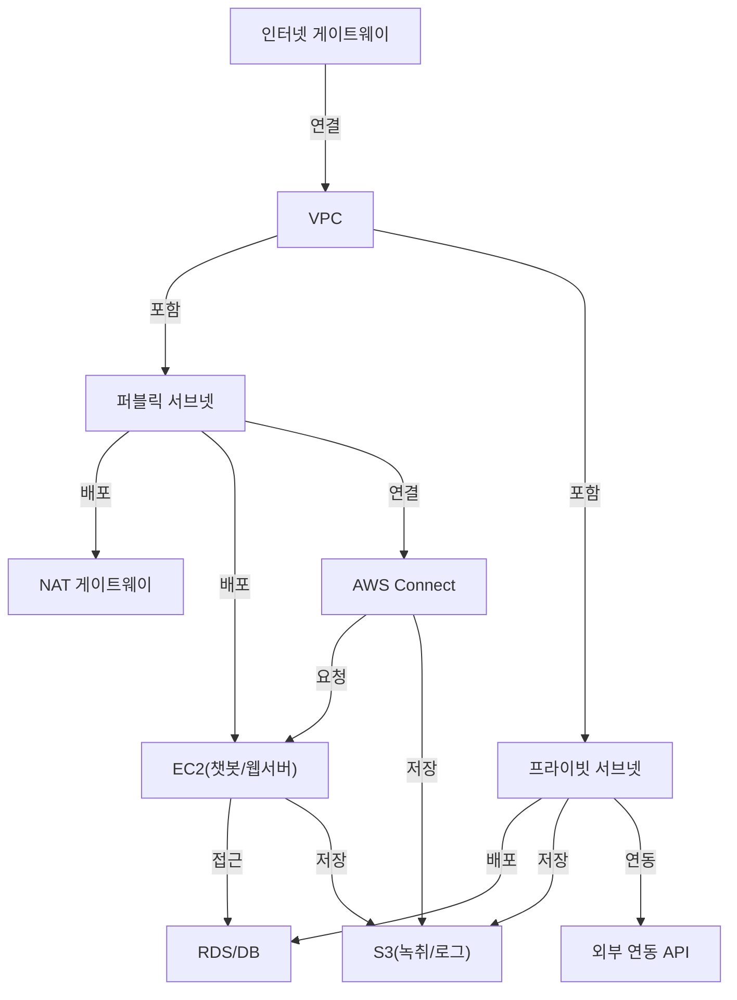

# 네트워크 아키텍처 다이어그램

## 1. 개요
- 본 다이어그램은 AICC 클라우드 인프라의 네트워크 구조를 시각적으로 설명합니다.

## 2. Mermaid 네트워크 다이어그램 예시

## 3. 주요 구성요소 설명
- **VPC**: 네트워크 분리, 보안 경계
- **퍼블릭/프라이빗 서브넷**: 외부/내부 서비스 분리
- **NAT 게이트웨이**: 프라이빗 서브넷의 외부 접근 지원
- **인터넷 게이트웨이**: 퍼블릭 서브넷의 인터넷 연결
- **AWS Connect**: 음성/채팅 라우팅, 상담원 연결
- **EC2**: 챗봇, 웹서버 등 서비스 배포
- **S3**: 녹취, 로그, 파일 저장
- **RDS/DB**: 상담/고객 데이터 저장
- **외부 연동 API**: CRM, ERP 등 외부 시스템 연동

## 4. 데이터 흐름
- 고객 → AWS Connect → EC2/챗봇 → DB/S3
- 상담원 UI → EC2 → DB/S3
- 외부 연동 API ↔ DB/S3 