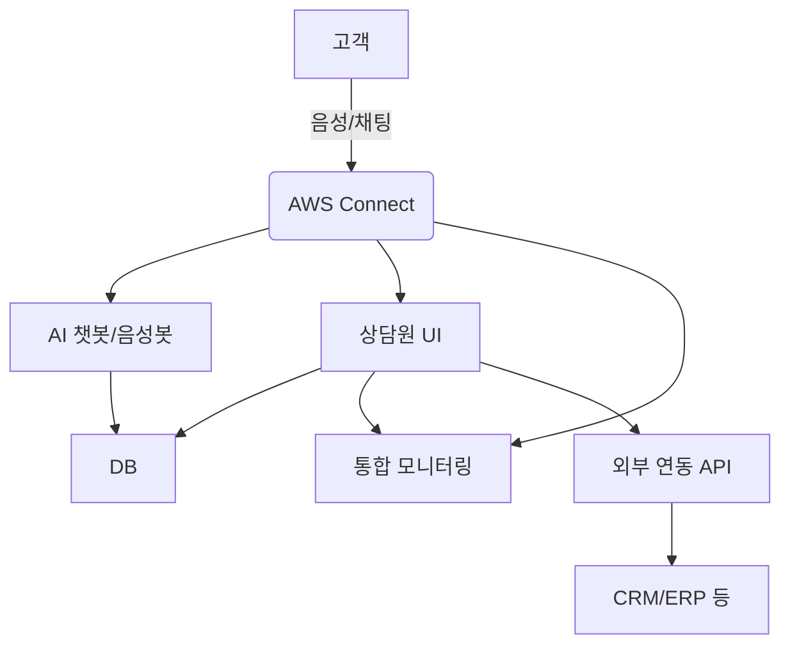

# 아키텍처 다이어그램 설명서

## 1. 전체 구조 개요
- 본 시스템은 AWS Connect를 중심으로 AI 챗봇/음성봇, 상담원 UI, 통합 모니터링, 데이터베이스, 외부 연동 등으로 구성됨.
- 각 서비스는 클라우드 환경에서 마이크로서비스 형태로 분리되어 유연한 확장 및 유지보수가 용이함.

## 2. 주요 구성요소 및 역할
| 구성요소           | 주요 역할 및 설명                                  |
|--------------------|---------------------------------------------------|
| AWS Connect        | 음성/채팅 라우팅, 상담원 연결, 녹취, IVR           |
| AI 챗봇/음성봇      | 자연어 처리, 자동 응대, FAQ, 시나리오 처리         |
| 상담원 UI          | 웹 기반 상담 인터페이스, 고객정보/상담이력 조회    |
| 통합 모니터링      | 실시간 현황, 품질 통계, 장애 알림                  |
| 데이터베이스(DB)   | 상담 이력, 고객 정보, 로그, 통계 데이터 저장       |
| 외부 연동 API      | CRM, ERP, SMS, 이메일 등 외부 시스템 연동          |

## 3. 서비스 연동 구조
- AWS Connect ↔ AI 챗봇/음성봇: 고객 문의 자동 응대 및 상담원 연결 전환
- AWS Connect ↔ 상담원 UI: 실시간 상담 세션, 고객 정보 제공
- 상담원 UI ↔ DB: 상담 이력, 고객 정보 조회/저장
- 모니터링 ↔ 각 서비스: 상태/로그 수집, 대시보드 제공
- 외부 연동 API ↔ DB/상담원 UI: 외부 시스템 데이터 연동

## 4. 참고
- 실제 다이어그램은 별도 툴(Whimsical, draw.io 등)로 작성하여 첨부 

## 5. 아키텍처 다이어그램(Mermaid 예시)

## 6. AWS Connect 주요 기능
- IVR(자동응답), 라우팅, 상담원 연결, 녹취, 실시간 모니터링, 통계 등

## 7. 서비스 간 데이터 흐름
- 고객 문의 → AWS Connect → (AI 챗봇 자동응대 or 상담원 연결)
- 상담원 UI/챗봇 → DB(상담 이력, 고객 정보 저장)
- 모니터링 서비스가 각 서비스의 상태/로그 수집
- 외부 연동 API를 통한 CRM/ERP 데이터 송수신 