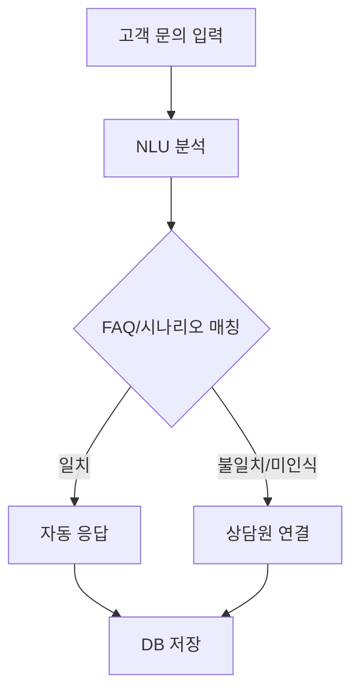
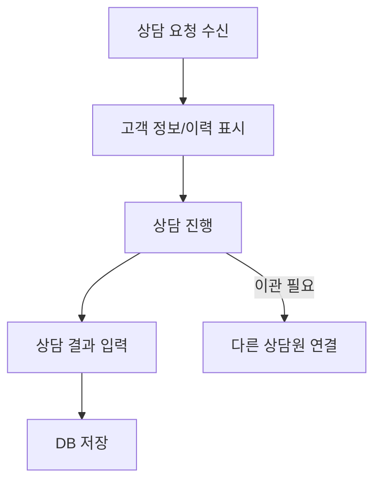
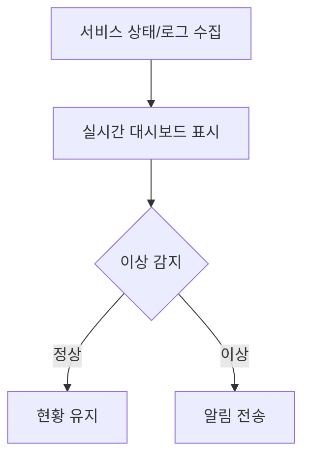

# 주요 기능 상세 설계서

## 1. AI 챗봇/음성봇
- **목적:** 고객의 반복 문의 자동 응대, 상담원 연결 전환
- **주요 플로우:**
  1. 고객 문의 입력 → NLU 분석 → FAQ/시나리오 응답 → 필요시 상담원 연결
- **화면/UX:**
  - 채팅 UI, 음성 안내, 대기/전환 메시지
- **예외 처리:**
  - 미인식/오답변 시 재질문, 상담원 자동 연결
- **데이터 흐름:**
  - 고객 입력 → 챗봇 엔진 → 응답/DB 저장
- **확장성:**
  - 시나리오/FAQ 추가, 다국어 지원, AI 모델 교체 용이

## 1-1. 챗봇 플로우차트(Mermaid)

### 챗봇 화면설계(예시)
| 구분   | 주요 UI 요소           |
|--------|-----------------------|
| 채팅창 | 입력창, 전송버튼, 답변 영역 |
| 음성   | 마이크 버튼, 음성 안내, 텍스트 변환 |

### 챗봇 API 연동 구조
- `/api/chatbot/respond` : 고객 입력 → 챗봇 응답 반환
- `/api/consults` : 상담원 연결 시 상담 등록

## 2. 상담원 UI
- **목적:** 실시간 상담, 고객 정보/이력 조회, 업무 처리
- **주요 플로우:**
  1. 상담 요청 수신 → 고객 정보/이력 표시 → 상담 진행 → 결과 입력/저장
- **화면/UX:**
  - 고객 정보 패널, 채팅/음성창, 상담 스크립트, 업무 처리 버튼
- **예외 처리:**
  - 연결 실패/중단 시 재시도, 이관 기능
- **데이터 흐름:**
  - UI ↔ DB(고객/상담 이력), UI ↔ AWS Connect(상담 세션)
- **확장성:**
  - 신규 채널(모바일 등) 지원, UI 컴포넌트 추가

## 2-1. 상담원 UI 플로우차트(Mermaid)

### 상담원 UI 화면설계(예시)
| 구분         | 주요 UI 요소                       |
|--------------|------------------------------------|
| 정보 패널    | 고객명, 연락처, 상담 이력           |
| 상담창       | 채팅/음성, 스크립트, 전송/종료 버튼 |
| 업무 처리    | 결과 입력, 이관, 저장 버튼          |

### 상담원 UI API 연동 구조
- `/api/customers/{customer_id}` : 고객 정보 조회
- `/api/consults` : 상담 등록/이력 조회

## 3. 통합 모니터링
- **목적:** 실시간 상담 현황, 품질 통계, 장애 감지/알림
- **주요 플로우:**
  1. 각 서비스 상태/로그 수집 → 대시보드 표시 → 이상 감지 시 알림
- **화면/UX:**
  - 실시간 대시보드, 상담원/고객 현황, 알림/이벤트 로그
- **예외 처리:**
  - 데이터 수집 실패 시 재시도, 장애 자동 알림
- **데이터 흐름:**
  - 각 서비스 → 모니터링 → 관리자 UI
- **확장성:**
  - 모니터링 항목/알림 정책 추가, 외부 연동(슬랙 등)

## 3-1. 모니터링 플로우차트(Mermaid)

### 모니터링 화면설계(예시)
| 구분     | 주요 UI 요소                 |
|----------|-----------------------------|
| 대시보드 | 상담 현황, 트래픽, 장애 알림 |
| 이벤트   | 알림 리스트, 상세 로그       |

### 모니터링 API 연동 구조
- `/api/monitoring/status` : 서비스 상태 조회
- `/api/monitoring/events` : 이벤트/알림 조회

## 4. 기타 기능(예시)
- **녹취/저장:** 상담 녹취 파일 자동 저장, 검색/다운로드 기능
- **외부 연동:** CRM/ERP 등 외부 시스템과 실시간 데이터 송수신

---

※ 각 기능별 상세 플로우 차트, 화면 설계, API 연동 구조 등은 별도 문서로 추가 가능 